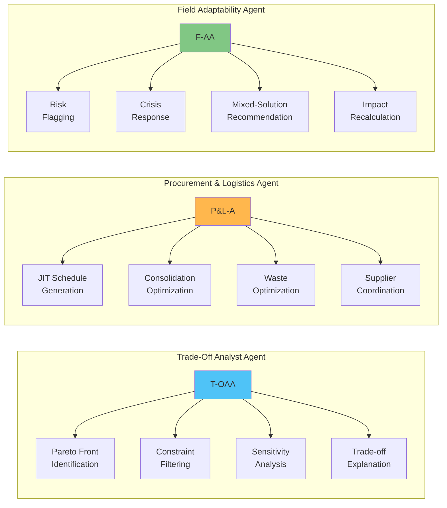

# StructuBIM Multi-Agent Architecture

## System Overview

This document defines the three-agent architecture for the RC Agent system, designed to support different users and phases of reinforced concrete construction projects.

---

## Architecture Diagram

---

## Detailed Workflow Sequence

---

## Agent Capabilities Matrix

---

## Data Flow Architecture

---

## Agent Interaction Model

---

## Key Features & Capabilities

### 1. Trade-Off Analyst Agent (T-OAA)
**Purpose:** Macro-level decision-making for optimal solution selection

**Key Capabilities:**
- **Pareto Front Identification:** Multi-objective optimization to find non-dominated solutions
- **Constraint Filtering:** Hard constraint validation (budget, schedule, material availability)
- **Recommendation Generation:** Detailed trade-off analysis of top 3-5 solutions
- **Sensitivity Analysis:** Real-time re-ranking with variable adjustments

**Input Data:**
- Phase 1 JSON (all solution summaries)
- Project constraints (budget, timeline, material preferences)
- Optimization weights (cost vs. time vs. CO₂ vs. constructability)

**Output Data:**
- Optimal Solution Set (3-5 solutions)
- Trade-off narratives
- Pareto front visualization
- Selected Primary Solution (RS-P)

---

### 2. Procurement & Logistics Agent (P&L-A)
**Purpose:** Transform chosen solution into executable procurement and delivery plan

**Key Capabilities:**
- **JIT Schedule Generation:** Least Responsible Moment (LRM) framework implementation
- **Consolidation Optimization:** Group identical materials across elements/stories
- **Waste Optimization:** Analyze cut lengths and splice patterns
- **Supplier Coordination:** Generate optimized purchase orders

**Input Data:**
- Chosen RS-P ID
- Phase 2 JSON (detailed element breakdown)
- Master construction schedule
- Market data (lead times, pricing)

**Output Data:**
- Phased procurement schedule
- Purchase order list
- Logistics plan
- Waste optimization report

---

### 3. Field Adaptability Agent (F-AA)
**Purpose:** Real-time problem-solving and construction momentum maintenance

**Key Capabilities:**
- **Proactive Risk Flagging:** Alert on high constructability index elements
- **Crisis Response:** Quick alternate solution identification
- **Mixed-Solution Recommendation:** Floor-by-floor solution switching
- **Impact Recalculation:** Real-time cost/schedule analysis

**Input Data:**
- Chosen RS-P ID
- Phase 2 JSON (detailed metrics)
- Current site conditions
- Phase 1 JSON (all solutions for alternatives)

**Output Data:**
- Constructability alerts
- Alternate solution recommendations (RS-A)
- Net impact analysis (cost, schedule, materials)
- Actionable directives

---

## Implementation Notes

### Agent Communication Protocol
1. **Sequential Flow:** T-OAA → P&L-A → F-AA (primary workflow)
2. **Feedback Loops:** F-AA can trigger re-analysis in T-OAA for major changes
3. **Data Sharing:** All agents access Phase 1 & Phase 2 JSON as needed
4. **State Management:** Each agent maintains context of selected solution (RS-P)

### Critical Interactions
- **T-OAA to P&L-A:** RS-P selection triggers procurement planning
- **P&L-A to F-AA:** Delivery schedule informs risk assessment
- **F-AA to T-OAA:** Crisis may require re-optimization with new constraints

### Export Capabilities
- All agents support "Export to Sheets" functionality
- Standard report formats for stakeholder communication
- Real-time dashboard updates

---

## Next Steps for Implementation

1. **Refactor existing Phase 1 tools** → Map to T-OAA capabilities
2. **Refactor existing Phase 2 tools** → Split between P&L-A and F-AA
3. **Implement agent orchestration** → Define communication protocols
4. **Create specialized prompts** → Tailored system prompts for each agent
5. **Build user interfaces** → Role-based access for different stakeholders
6. **Add state management** → Track solution selection across agent transitions

